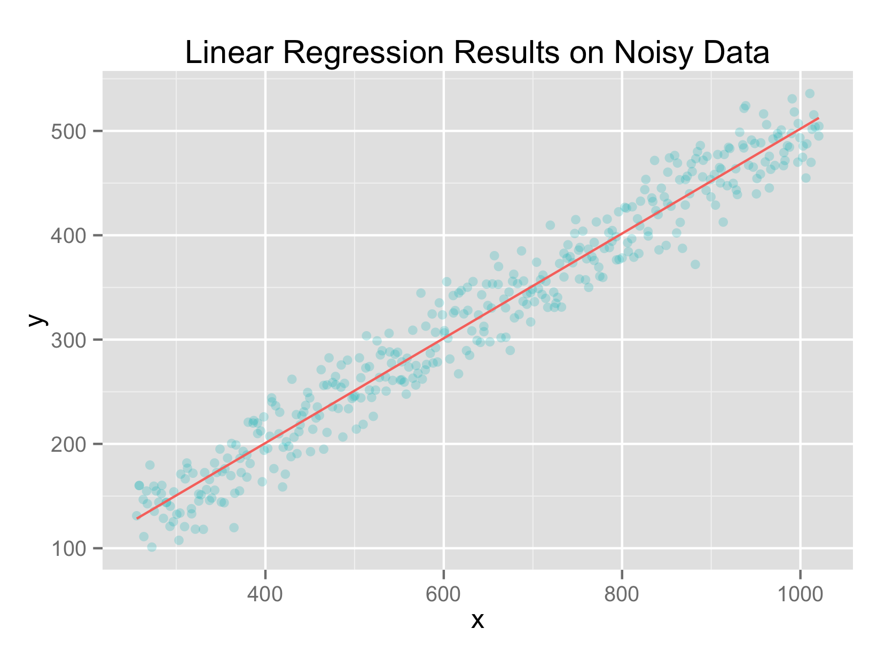
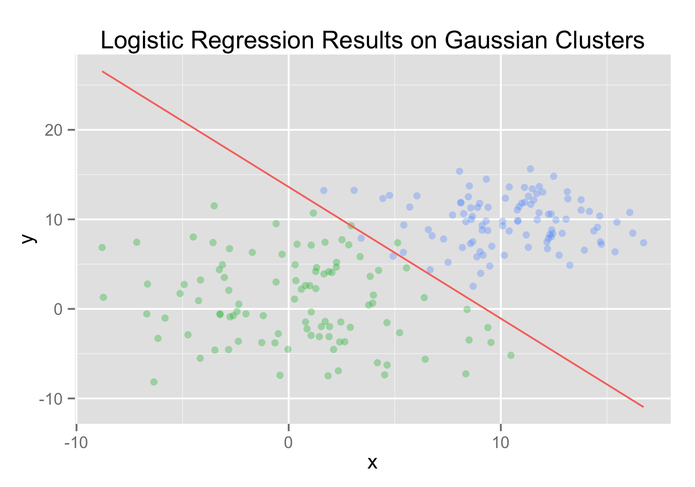
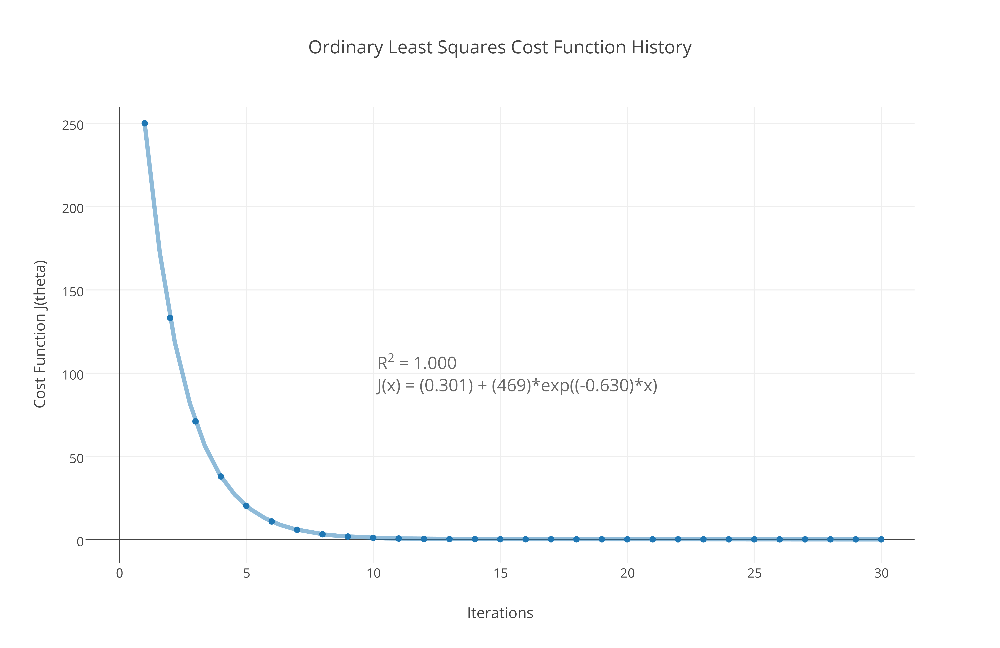

## Generalized Linear Models
### `import "github.com/cdipaolo/goml/linear"`

[](https://godoc.org/github.com/cdipaolo/goml/linear)

This part of the `goml` package implements varied generalized linear models using gradient descent (currently, though more options for optimization methods might be available in the future.)

### implemented models

- [ordinary least squares](linear.go)
- [locally weighted linear regression](local_linear.go)
- [logistic regression](logistic.go)
- [softmax regression (multiclass logistic regression)](softmax.go)

Linear Least Squares Regression Results                           | Logistic Regression Classification Results
:-----------------------------------------------------------------:-------------------------------------------------------:
 | 

### example ordinary least squares

this is mostly from from the `linear_test.go` tests. You can find more examples from the testing files. The line given is `z = 10 + (x/10) + (y/5)`
```go
// initialize data
threeDLineX = [][]float64{}
threeDLineY = []float64{}
// the line z = 10 + (x/10) + (y/5)
for i := -10; i < 10; i++ {
    for j := -10; j < 10; j++ {
        threeDLineX = append(threeDLineX, []float64{float64(i), float64(j)})
        threeDLineY = append(threeDLineY, 10+float64(i)/10+float64(j)/5)
    }
}

// initialize model
//
// use optimization method of Stochastic Gradient Ascent
// use α (learning rate) = .0001 / 1e-4
// use λ (regularization term) = 13.06
// set the max iteration cap for gradient
//     descent to be 1000/1e3 iterations
// and finally pass in the data
model, err := linear.NewLeastSquares(base.StochasticGA, 1e-4, 13.06, 1e3, threeDLineX, threeDLineY)
if err != nil {
    panic("Your training set (either x or y) was nil/zero length")
}

// learn
err = model.Learn()
if err != nil {
    panic("There was some error learning")
}

// predict based on model
guess, err = model.Predict([]float64{12.016, 6.523})
if err != nil {
    panic("There was some error in the prediction")
}

// persist the model to disk
//
// path to file will be '/tmp/.goml/LeastSquares'
// and it stores the parameter vector θ as a JSON
// array
err = model.PersistToFile("/tmp/.goml/LeastSquares")
if err != nil {
    panic("There was some error persisting the model to a file!")
}

// restore the model from file
//
// note that you could have a file with a JSON
// array of floats from some other tool and it
// would import correctly as well
err = model.RestoreFromFile("/tmp/.goml/LeastSquares")
if err != nil {
    panic("There was some error persisting the model to a file!")
}
```

### gradient descent optimization

Here's some data relating the cost function J(θ) and the number of iterations of the data using a 3d model. Note that in this case the data modeled off of was perfectly linear, so obviously the cost function wouldn't and shouldn't bottom out at 0.000... for real world data!


